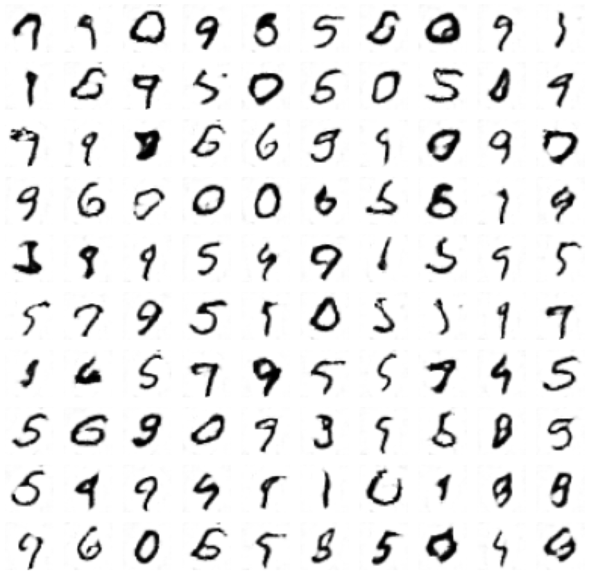
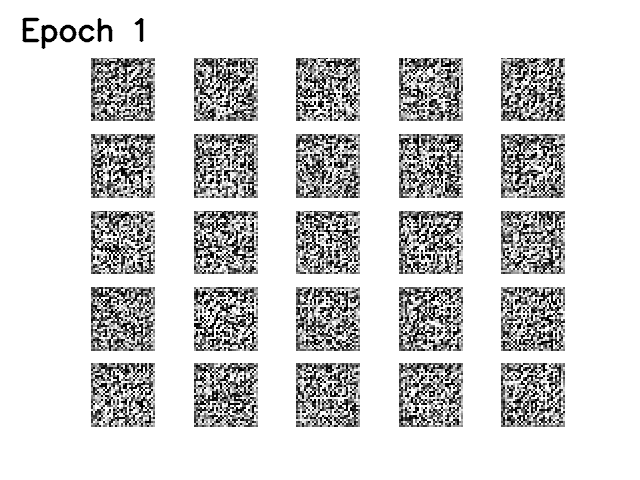

# GAN on MNIST
Implementation of DCGAN on MNIST dataset.

## How to run
Run with
```python main.py --name name_of_the_experiment```
Make sure your CUDA is available, see **main.py** for all parameters.

## Model architecture
I chose quite small sizes of models, with 3 convolutional layers for both the discriminator and (de-convolutional) for the generator, to make the model train quickly. Probably with additional layers the results would look more realistic, but my hardware limited the possibilities of the experiments.
## Dicriminator
```python
Discriminator(
  (main): Sequential(
    (0): Conv2d(1, 64, kernel_size=(4, 4), stride=(2, 2), padding=(1, 1))
    (1): BatchNorm2d(64, eps=1e-05, momentum=0.1, affine=True, track_running_stats=True)
    (2): LeakyReLU(negative_slope=0.2)
    (3): Conv2d(64, 128, kernel_size=(4, 4), stride=(2, 2), padding=(1, 1))
    (4): BatchNorm2d(128, eps=1e-05, momentum=0.1, affine=True, track_running_stats=True)
    (5): LeakyReLU(negative_slope=0.2)
    (6): Conv2d(128, 256, kernel_size=(4, 4), stride=(2, 2), padding=(1, 1))
    (7): LeakyReLU(negative_slope=0.2)
  )
  (classifier): Sequential(
    (0): Linear(in_features=4096, out_features=1, bias=True)
    (1): Sigmoid()
  )
)
```
## Generator
```
Generator(
  (linear): Linear(in_features=100, out_features=4096, bias=True)
  (lrelu): LeakyReLU(negative_slope=0.2)
  (generator): Sequential(
    (0): ConvTranspose2d(256, 128, kernel_size=(4, 4), stride=(2, 2), padding=(1, 1))
    (1): BatchNorm2d(128, eps=1e-05, momentum=0.1, affine=True, track_running_stats=True)
    (2): LeakyReLU(negative_slope=0.2)
    (3): ConvTranspose2d(128, 64, kernel_size=(4, 4), stride=(2, 2), padding=(1, 1))
    (4): BatchNorm2d(64, eps=1e-05, momentum=0.1, affine=True, track_running_stats=True)
    (5): LeakyReLU(negative_slope=0.2)
    (6): ConvTranspose2d(64, 1, kernel_size=(4, 4), stride=(2, 2), padding=(1, 1))
    (7): Tanh()
  )
)
```

## Training
I trained the model for 50 epochs, with batch_size=64.

The loss was most informative in terms of what the progress of the discriminator was. The loss of generator was growing as the discriminator improved.

## Results
### 100 random outputs
Below I present the images created by the generator after 50 epochs. Some of them look like real digits, some are still hardly identifiable. I think that increasing the size of the model - adding an additional hidden layer could help.

### Animated progress

### Interpolation between 6 and 9
I chose 2 points in the latent space that were represented by 6 and 9. By interpolating these points we can see how the image slowly turns from 6 into a 9. The transition seems to be going through the digit 8.


## What I've learned:
* It takes some time at the beginning for discriminator to train. Only after that the generator begins to train.
* Make sure your dataset is properly normalized/preprocessed. It took me a while to figure out that MNIST images pixel values are already in [0, 1].
* BatchNorm helps a lot